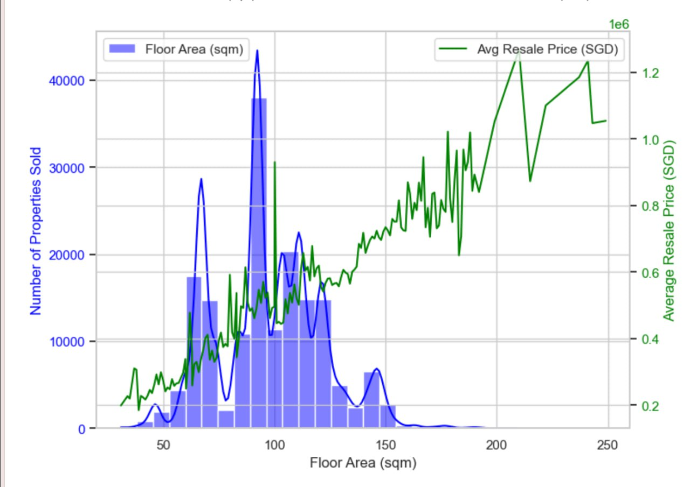
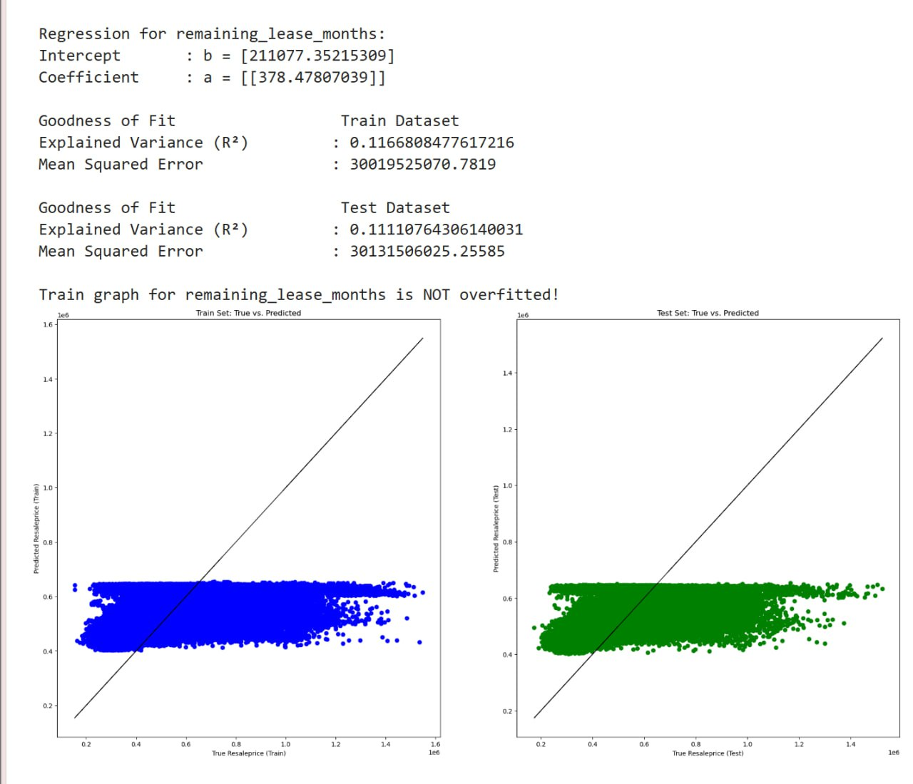
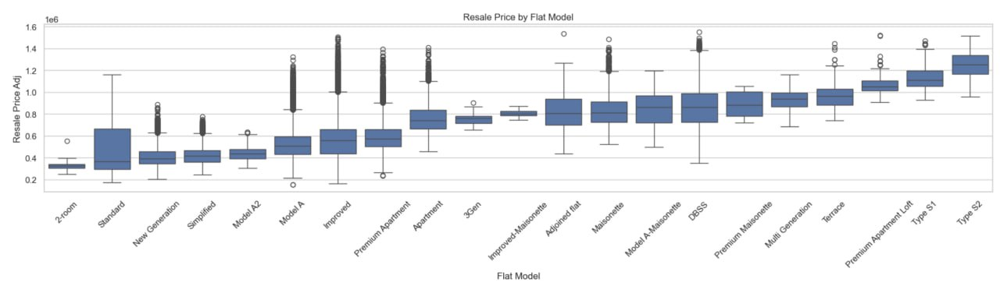
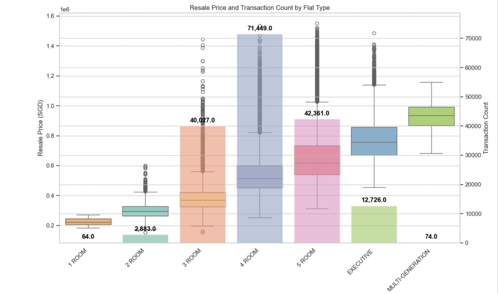
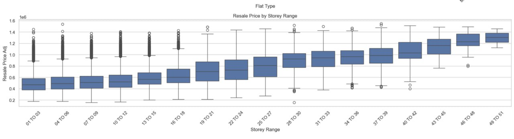
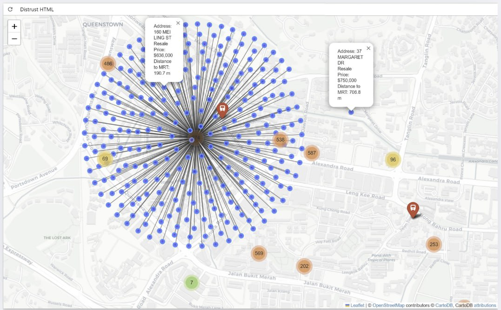
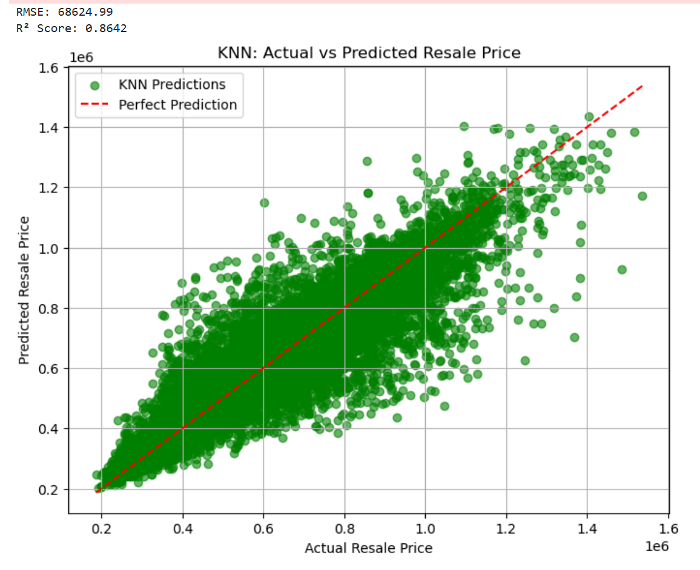
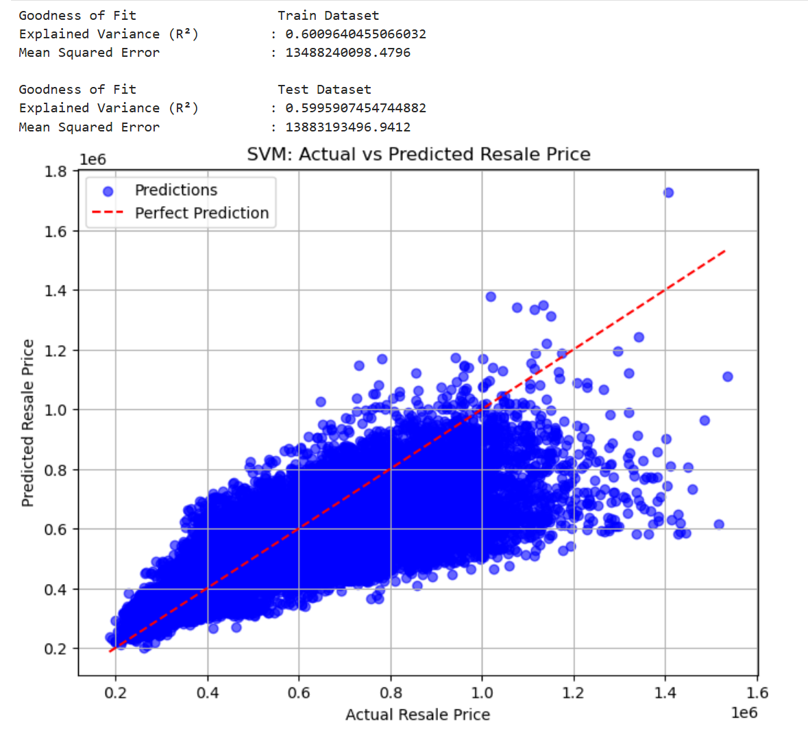
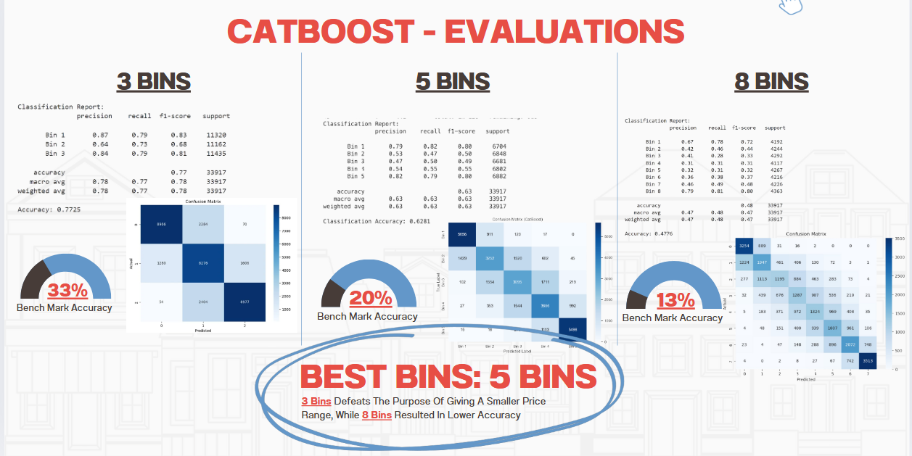
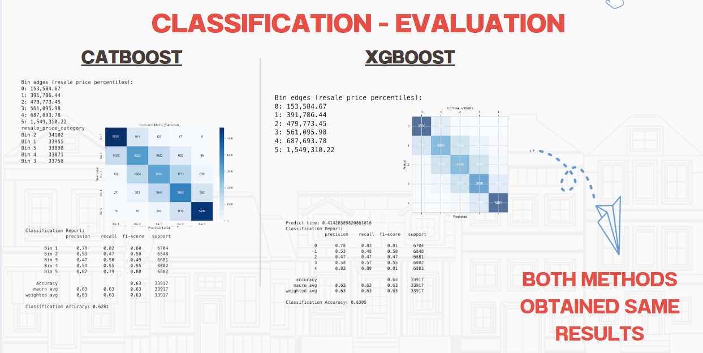

# SC1015: Resale Price Analysis
Our team's objective is to analyse the factors that affect resale prices of HDB flats in Singapore, from 2017 to 2024's first month. For detailed walkthrough, please view code in order from:
1. Data Cleaning
2. Exploratory Data Analysis (EDA) which are further split into:
   
   A. Numerical Variables.       
   B. Categorical Variables.  
   C. Clustering.  
   D. Geolocation.  
   E. Variable: distance_to_mrt_m.
   
4. Machine Learning which contains:
   
   A. Regression.  
   B. Classification.

## Practical Motivation
In Singapore, the resale market under the Housing and Development Board (HDB) plays a pivotal role in housing the nation. However, there exists a pressing need to leverage advanced analytical techniques to unravel the underlying dynamics necessary to make informed decisions. In an article on [Straits Times, 2024](https://www.straitstimes.com/singapore/more-than-half-of-singaporeans-may-delay-plans-to-buy-home-due-to-inflation-fears-study), house-buying sentiment is cautious. A significant number of Singaporeans are feeling uncertain about making big financial decisions—like buying a home—because they are worried about rising prices, in other words, inflation. Demand may temporarily dip too. If many potential buyers delay their home purchases, the short-term housing demand might decrease, which could slow down resale volume or price growth—especially in the private market or higher-end HDB flats.

## Problem Definition
Are the claims according to public perception about HDB really true?
- Larger floor areas tend to fetch higher resale prices.  
- Older flats (40+ years old) are assumed to be less desirable and cheaper.  
- Premium flat models (eg: Premium Apartment, DBSS, Improved) tend to fetch higher prices.  
- Larger flat types (5-room) are expected to have higher prices, because they offer more space.  
- Higher floors (19 to 21, 22 to 24) are believed to have higher prices, due to better views, privacy, less noise compared to lower floors.  
- The nearer the distance to the nearest MRT, the higher the resale price, due to greater accessibility.  

## What are the Columns in Dataset?
📌 Column: town
['ANG MO KIO' 'BEDOK' 'BISHAN' 'BUKIT BATOK' 'BUKIT MERAH' 'BUKIT PANJANG'
 'BUKIT TIMAH' 'CENTRAL AREA' 'CHOA CHU KANG' 'CLEMENTI' 'GEYLANG'
 'HOUGANG' 'JURONG EAST' 'JURONG WEST' 'KALLANG/WHAMPOA' 'MARINE PARADE'
 'PASIR RIS' 'PUNGGOL' 'QUEENSTOWN' 'SEMBAWANG' 'SENGKANG' 'SERANGOON'
 'TAMPINES' 'TOA PAYOH' 'WOODLANDS' 'YISHUN']

-------------------------------------------------------------------------------

📌 Column: flat_type
['2 ROOM' '3 ROOM' '4 ROOM' '5 ROOM' 'EXECUTIVE' '1 ROOM'
 'MULTI-GENERATION']

--------------------------------------------------------------------------------

📌 Column: storey_range
['10 TO 12' '01 TO 03' '04 TO 06' '07 TO 09' '13 TO 15' '19 TO 21'
 '22 TO 24' '16 TO 18' '34 TO 36' '28 TO 30' '37 TO 39' '49 TO 51'
 '25 TO 27' '40 TO 42' '31 TO 33' '46 TO 48' '43 TO 45']

--------------------------------------------------------------------------------

📌 Column: avg_storey
[11.  2.  5.  8. 14. 20. 23. 17. 35. 29. 38. 50. 26. 41. 32. 47. 44.]

--------------------------------------------------------------------------------

📌 Column: flat_model
['Improved' 'New Generation' 'DBSS' 'Standard' 'Apartment' 'Simplified'
 'Model A' 'Premium Apartment' 'Adjoined flat' 'Model A-Maisonette'
 'Maisonette' 'Type S1' 'Type S2' 'Model A2' 'Terrace'
 'Improved-Maisonette' 'Premium Maisonette' 'Multi Generation'
 'Premium Apartment Loft' '2-room' '3Gen']

--------------------------------------------------------------------------------

📌 Column: year
[2017 2018 2019 2020 2021 2022 2023 2024]

# Algorithms / Libraries / Tools
- Pandas 
- Seaborn
- K Means Clustering
- One Map API
- Folium Map
- Geodesic
- Linear Regression
- Keras Neural Network (KNN Regression)
- Support Vector Regression (SVR)
- Adaptive Binning
- Cat Boost Classifier
- eXtreme Gradient Boosting (XG Boost)

# Insights
### 1️⃣ "Larger floor areas are the most demanded." -- False

   

   It suggests high preference for larger spaces =/ highest price. The volume of HDB is demand-driven, rather than value-per-unit-size. Even though larger flats are rare, they command higher average prices -- possibly due to exclusive flat types. 

###  2️⃣ "Older flats (40+ years old) are assumed to be less desirable and cheaper." -- False  

   

   The linear regression between the remaining_lease in terms of months and resale price has a poor predictive power, R^2 is 0.1, suggesting lease decay alone does not drive resale prices. Contrary to public perception, the age of flats, or in other words the remaining lease, weakly affects the resale prices. Lease decay **does affect** resale prices to some extent—but **not as strongly as many people assume**. Here are some possible reasons:  

**1. Market Sentiment Remains Resilient**  
Despite concerns, data shows that **resale prices of older HDB flats are not crashing**. In fact, the number of million-dollar resale flats—including older ones—is rising. This indicates that **other factors like size, location, and scarcity of large units matter more** to buyers.

**2. Government Support Helps Mitigate Concerns**  
Policies like the **[Voluntary En-bloc Redevelopment Scheme (VERS)](https://www.propertyreview.sg/should-you-be-concerned-hdb-about-lease-decay-in-2025/)** and ongoing discussions about **lease buyback and upgrading** offer homeowners **greater security** and keep confidence in the resale market relatively stable.

### 3️⃣ "Premium flat models (eg: Premium Apartment, DBSS, Improved) tend to fetch higher prices." -- True

   

### 4️⃣ "Larger flat types (5-room) are expected to have higher prices, because they offer more space." -- True but Demand is not the highest

    
   
   This chart compares HDB resale prices and transaction counts across flat types, showing both price distribution (boxplots) and volume (bar heights). The picture shows 4-room flats dominate in demand popularity.

### 5️⃣ "Higher floors (19 to 21, 22 to 24) are believed to have higher prices, due to better views, privacy, less noise compared to lower floors." -- Not Always

   
   
   There are constant outliers for the lower storey ranges, and these outlieres still fetch high resale prices.

### 6️⃣ "The nearer the distance to the nearest MRT, the higher the resale price, due to greater accessibility." -- Not Always

   
   
   The picture above shows resale prices relating to their distances to MRT stations, with blue dots representing listings, highlighting spatial proximity and pricing. Here, a house of 190 metres away gives a lower price of 630 000 than a house of 700 metres away which is valued at 750 000, demonstrating not all houses are more expensive when they are nearer to the MRT, contradicting popular belief.

## Machine Learning Techniques:
Our project tackled the challenge of predicting HDB resale prices using machine learning, aiming to help both buyers and sellers better understand market valuation and make informed decisions.  

**Single-Variate Regression**  
We began by applying single-variate linear regression models to evaluate the predictive strength of individual numerical features:  
Floor Area: 39% accuracy  
Remaining Lease (in months): 11% accuracy  
Distance to MRT: 1% accuracy  
These results suggested that no single feature could sufficiently explain resale prices, affirming the **complexity** of real estate valuation.  

**Multi-variate Linear Regression**

   

Next, we combined the three numerical features into a multi-variate linear regression model, which improved predictive accuracy to 48%. This revealed a key insight: resale prices are influenced by a combination of factors, **not isolated attributes**. However, the linear model was still limited in capturing non-linear relationships.  

**Non-linear Regression using K-Nearest Neighbors (KNN)**  

This is something new we learnt:   
KNN  

   

To improve model performance, we turned to K-Nearest Neighbors (KNN) regression. Unlike traditional models, KNN is instance-based and non-parametric. It does not make prior assumptions about the data distribution, but instead makes predictions by referencing nearby points in the training set.  

Features Used: Floor Area, Remaining Lease, Distance to MRT  
Preprocessing: Data scaling applied  
Evaluation Metrics: RMSE and R² Score  

KNN significantly outperformed the previous models with an R² score of 86%, capturing non-linear patterns that linear models missed. This model highlighted the strength of memory-based learning for dynamic real-world data.  

**Support Vector Regression (SVR)**  

Building on earlier models, we applied SVR and it achieved an R² score of ~0.60 on both training and test sets, indicating good generalization but moderate predictive power, especially compared to KNN’s 0.86 R².  

   

Key observations:  

**Moderate Accuracy**: The model captures general pricing trends, but predictions show noticeable variance, especially for outliers.     
**Systematic Bias**: SVR tends to overestimate lower-value properties and underestimate higher-value ones.     
**Error Spread**: A relatively high Mean Squared Error (~13.4M–13.8M) indicates significant unexplained variance.      
**Outlier Sensitivity**: Predictions are least reliable for top-tier properties (~1.5M SGD).      
**Best Performance Range**: Predictions are most stable in the 600k–1M SGD range, where data is denser.  

While SVR improves on linear regression (48% R²), it lags behind KNN’s ability to capture complex, non-linear patterns. Still, its stable performance across datasets makes it a viable option for moderate-precision use cases, particularly where model interpretability and consistency are valued.    

## From Regression to Classification: Addressing Price Ranges
We realized that buyers and sellers often think in price ranges rather than exact amounts. Thus, we developed a classification model to predict which price bin a flat belongs to. This shift aligned with real-world decision-making and introduced a fresh dimension to our analysis.  

**Cat Boost Classifier**

   

We utilized CatBoost, a gradient boosting algorithm optimized for categorical data. It iteratively improves predictions by learning from prior mistakes, akin to refining a skill with experience.  
Key Features: Town, Flat Type, Model, Storey.    
Target Variable: Resale Price Range (via adaptive binning).    
Bins Tested: 3, 5, and 8.    

We found that:  
   3 bins gave the highest accuracy but oversimplified the results  
   8 bins offered more granularity but reduced model performance  
   5 bins struck a balance between interpretability and precision  

**Introducing XGBoost for Comparison**

   

To further validate our approach, we employed XGBoost, another gradient boosting model that excels at producing well-calibrated class probabilities.  
Both CatBoost and XGBoost consistently delivered accuracies 3x higher than random guessing (20%), reinforcing their reliability. The combination of structured inputs and effective binning was instrumental in reaching these results.  

# What is something new that we learnt?
- The importance of Data Cleaning and how it impacts Accuracy and Correlation between factors
- Geolocation, Geopandas
- API Usage, to fetch coordinates of full addresses of a large database containing thousands of addresses
- Regression
- Cat Boost Classifier
- Function formatting
- Annotation Clustering
- One Hot Encoding

# Key Takeaways & Recommendations
1. **Pricing is Multi-Dimensional**  
Resale pricing is not determined by a single factor like floor level or proximity to MRT stations. While higher floors can command a premium, lower-floor flats are not inherently undervalued, and lease decay shows weaker predictive power than commonly perceived.  
Our analysis reveals that pricing is shaped by the interaction of multiple variables, including town, flat type, remaining lease, storey range, and distance to MRT.

2. **Empowering Homeowners with AI**  
Rather than relying on guesswork or hearsay, homeowners can turn to machine learning models for informed pricing decisions. K-Nearest Neighbors (KNN) delivers the most accurate regression results. CatBoost and XGBoost both perform well in classifying flats into price ranges, with comparable accuracy and stability. These tools provide a data-driven foundation for valuation, helping reduce overpricing or undervaluation errors.  

3. **Prioritizing Precision Over Broad Accuracy**  
In classification, precision matters more than general accuracy, especially when the goal is to avoid overestimating a home’s value. By minimizing false positives, homeowners are less likely to set unrealistic price expectations, leading to more efficient and fairer transactions.  

4. **Towards More Transparent Models**  
We are actively exploring multi-modal approaches, incorporating external economic indicators and textual listing data to further refine model predictions.  
Our goal is to build models that are not just accurate, but also interpretable, accessible, and adaptable to real-world decision-making needs.  

# Contributors
Both - Data Cleaning, Classification.  
@ Sie Khai Hinn Crystaline - EDA Numericals, Geolocation, Regression.  
@ Chua Jun Xiang - EDA Categoricals, Clustering, Canva Slides

# References
- https://www.researchgate.net/figure/Flow-chart-of-CatBoost-algorithm_fig1_368319203
- https://www.gov.sg/explainers/evolution-of-public-housing-in-singapore
- https://dollarbackmortgage.com/blog/rise-in-hdb-prices-factors/
- https://www.linkedin.com/pulse/predicting-singapore-resale-flat-prices-data-science-ammaiappan-9otkc?utm_source=share&utm_medium=member_ios&utm_campaign=share_via
- https://medium.com/analytics-vidhya/singapore-housing-prices-ml-prediction-analyse-singapores-property-price-part-iii-bd9438077423
- https://www.rateinflation.com/consumer-price-index/singapore-historical-cpi/
- https://www.straitstimes.com/singapore/more-than-half-of-singaporeans-may-delay-plans-to-buy-home-due-to-inflation-fears-study
