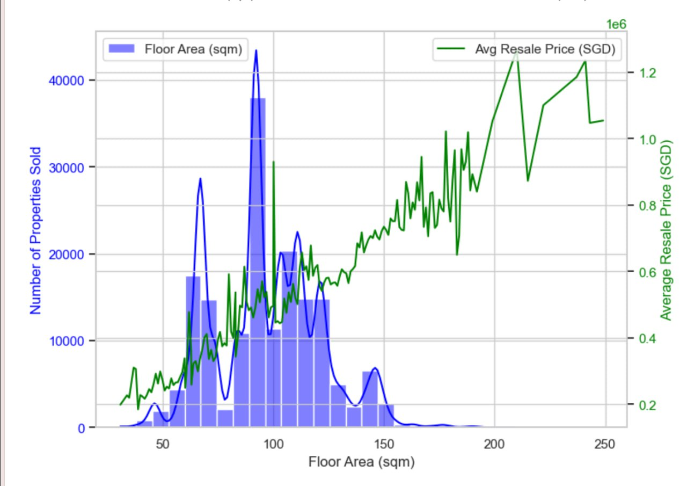
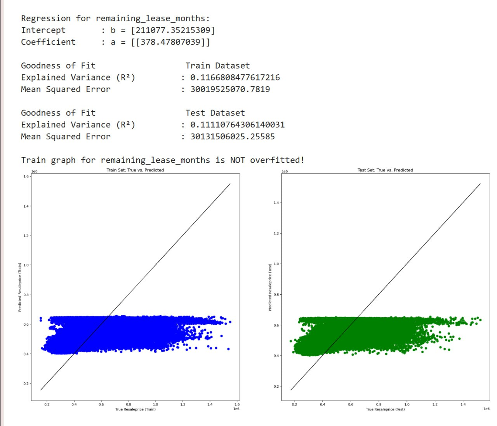
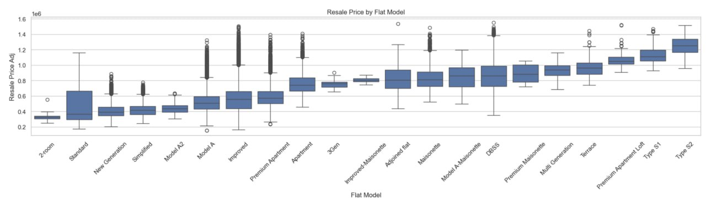
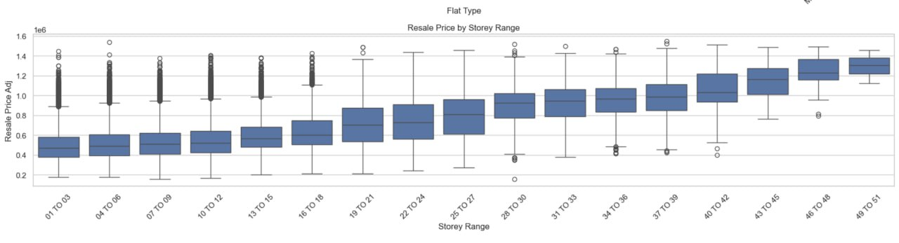
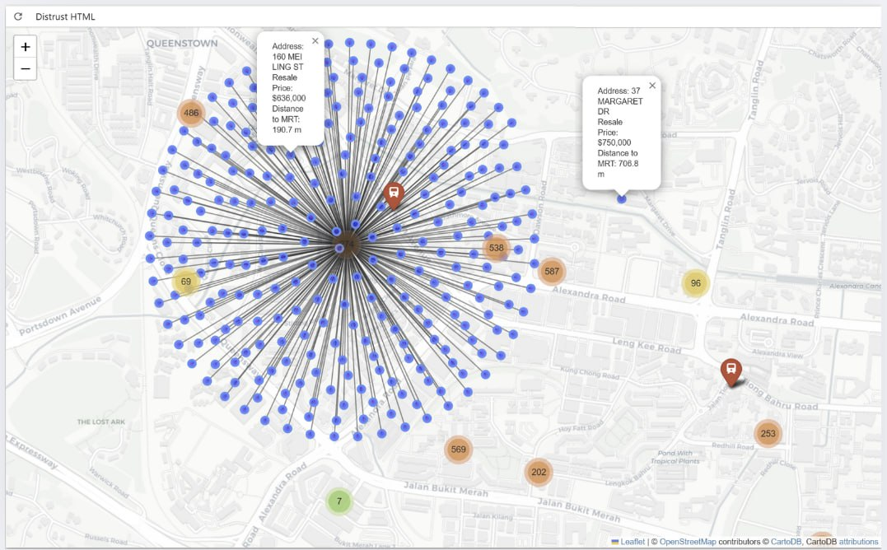

# SC1015-Resale-Price-Analysis
Our team's objective is to analyse the factors that affect resale prices of HDB in Singapore, from 2017 to 2024's first month. For detailed walkthrough, please view code in order from:
1. Data Cleaning
2. Exploratory Data Analysis (EDA) which are further split into:
   
   A. Numerical Variables.       
   B. Categorical Variables.  
   C. CLustering.  
   D. Geolocation.  
   E. Variable: distance_to_mrt_m.
   
4. Machine Learning which contains:
   
   A. Regression.  
   B. Classification.  
   
## Problem Definition
Are the claims according to public perception about HDB really true?
- Larger floor areas tend to fetch higher resale prices.  
- Older flats (40+ years old) are assumed to be less desirable and cheaper.  
- Premium flat models (eg: Premium Apartment, DBSS, Improved) tend to fetch higher prices.  
- Larger flat types (5-room) are expected to have higher prices, because they offer more space.  
- Higher floors (19 to 21, 22 to 24) are believed to have higher prices, due to better views, privacy, less noise compared to lower floors.  
- The nearer the distance to the nearest MRT, the higher the resale price, due to greater accessibility.  

## What are the Columns in Dataset?
📌 Column: town
['ANG MO KIO' 'BEDOK' 'BISHAN' 'BUKIT BATOK' 'BUKIT MERAH' 'BUKIT PANJANG'
 'BUKIT TIMAH' 'CENTRAL AREA' 'CHOA CHU KANG' 'CLEMENTI' 'GEYLANG'
 'HOUGANG' 'JURONG EAST' 'JURONG WEST' 'KALLANG/WHAMPOA' 'MARINE PARADE'
 'PASIR RIS' 'PUNGGOL' 'QUEENSTOWN' 'SEMBAWANG' 'SENGKANG' 'SERANGOON'
 'TAMPINES' 'TOA PAYOH' 'WOODLANDS' 'YISHUN']

-------------------------------------------------------------------------------

📌 Column: flat_type
['2 ROOM' '3 ROOM' '4 ROOM' '5 ROOM' 'EXECUTIVE' '1 ROOM'
 'MULTI-GENERATION']

--------------------------------------------------------------------------------

📌 Column: storey_range
['10 TO 12' '01 TO 03' '04 TO 06' '07 TO 09' '13 TO 15' '19 TO 21'
 '22 TO 24' '16 TO 18' '34 TO 36' '28 TO 30' '37 TO 39' '49 TO 51'
 '25 TO 27' '40 TO 42' '31 TO 33' '46 TO 48' '43 TO 45']

--------------------------------------------------------------------------------

📌 Column: avg_storey
[11.  2.  5.  8. 14. 20. 23. 17. 35. 29. 38. 50. 26. 41. 32. 47. 44.]

--------------------------------------------------------------------------------

📌 Column: flat_model
['Improved' 'New Generation' 'DBSS' 'Standard' 'Apartment' 'Simplified'
 'Model A' 'Premium Apartment' 'Adjoined flat' 'Model A-Maisonette'
 'Maisonette' 'Type S1' 'Type S2' 'Model A2' 'Terrace'
 'Improved-Maisonette' 'Premium Maisonette' 'Multi Generation'
 'Premium Apartment Loft' '2-room' '3Gen']

--------------------------------------------------------------------------------

📌 Column: year
[2017 2018 2019 2020 2021 2022 2023 2024]

# Contributors
Both - Data Cleaning, Classification. 
@ crystalryst, Sie Khai Hinn Crystaline - EDA Numericals, Geolocation, Regression.  
@ junxiang, Chua Jun Xiang - EDA Categoricals, CLustering, Canva Slides

# Algorithms / Libraries / Tools
- Pandas 
- Seaborn
- K Means Clustering
- One Map API
- Folium Map
- Geodesic
- Linear Regression
- Keras Neural Network (KNN Regression)
- Support Vector Regression (SVR)
- Adaptive Binning
- Cat Boost Classifier
- eXtreme Gradient Boosting (XG Boost)
- Grid Search Cross-Validation (GridSearch)

# Insights
### "Larger floor areas are the most demanded" -- Not Always

   
It suggests high supply =/ highest price. 
The volume of HDB is demand-driven, rather than value-per-unit-size. 
Even though larger flats are rare, they command higher average prices -- possibly due to exclusive flat types. 

### "Older flats (40+ years old) are assumed to be less desirable and cheaper." -- False  

   
The linear regression between the remaining_lease in terms of months and resale price has a poor predictive power, R^2 is 0.1. 
Contrary to public perception, the age of flats, or in other words the remaining lease, weakly affects the resale prices.
There are other more domineering factors in play.

### Premium flat models (eg: Premium Apartment, DBSS, Improved) tend to fetch higher prices. -- True

   

### Larger flat types (5-room) are expected to have higher prices, because they offer more space. -- True but Demand is not the highest
atach image

### Higher floors (19 to 21, 22 to 24) are believed to have higher prices, due to better views, privacy, less noise compared to lower floors. -- Not ALways

   
There are constant outliers for the lower storey ranges, and they fetch high resale prices.

### The nearer the distance to the nearest MRT, the higher the resale price, due to greater accessibility. -- Not Always

   
The picture above shows resale prices relating to their distances to MRT stations, with blue dots representing listings, highlighting spatial proximity and pricing. Here, a house of 190 metres away gives a lower price of 630 000 than a house of 700 metres away which is valued at 750 000, demonstrating not all houses are more expensive when they are nearer to the MRT, contradicting popular belief.

# What is something new that we learn?
- The importance of Data Cleaning and how it impacts Accuracy and Correlation between factors
- Geolocation
- API Usage, to fetch coordinates of full addresses of a large database containing thousands of addresses
- Regression
- Cat Boost Classifier

# Last Words
We hope in the future we can look into Machine Learning models that combine both categorical and numerical factors and discover unforeseen trends when doing so. 
